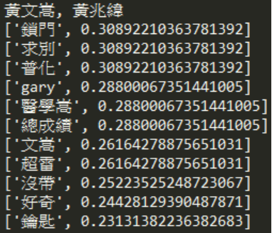

#tf-idf keyword extraction:

##Data
The original data for tf-idf keyword extraction is generated from "data crawling" section, which is a python dictionary

##Programs
1. DictToFile.py
  *use this program to transform original dictionary object into desired format, and save as file.

2. TFIDF.py
  *use this program to calculate tf-idf value and save result in two .txt files

##Usage
1. DictToFile.py
  
  `python DictToFile.py <user name>`
  
  for example
  
  `python DictToFile.py YAO`
  
  The data must be stored in `<user name>MsgDict.txt`.

2. TFIDF.py
  
  `python TFIDF.py <dir path> <result dir path>`
  
  for example
  
  `python TFIDF.py ./CHL_text/ ./CHL_tfidf/`
  
  The `<dir path>` is the path to the directory created by DictToFile.py.

##Result
The result is a list of words for each chat room, and the list is sorted by decreasing Tf-idf value. This is a demo result using my chat logs.

__黃文嵩__ is my roomate, so the keywords are all about our room, roomates, keys.

