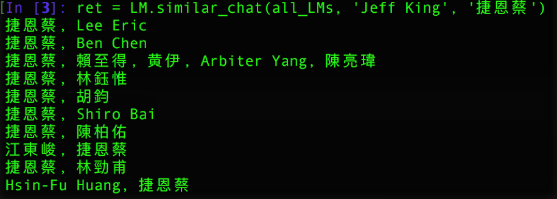
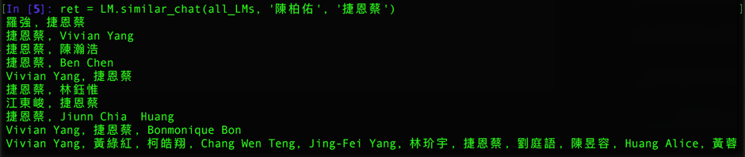
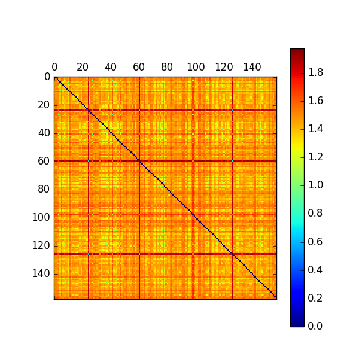
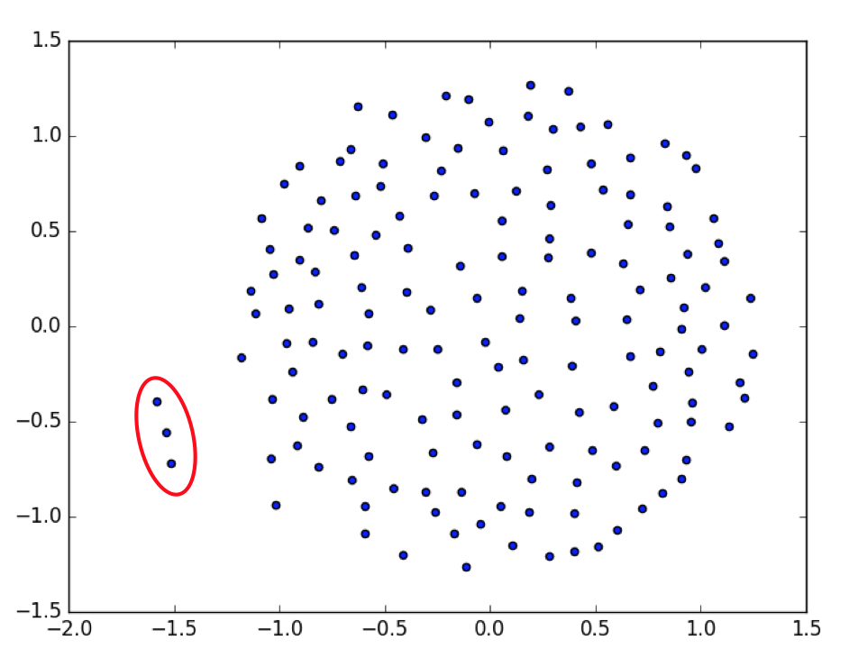

# visualize language model
You may refer to LM_usage.ipynb for running a quick demo.

## Analysis
After we built the language models, we can try to do some analysis on top of the language models. 
However, the language models space is very sparse, which make distance metric like L2 (the most commonly seen one) meaningless. To enable analysis on language models, we tried **inner_product**, **internal_variance**, **internal_absolute_vale** as the dissimilarity measurement. And finally we decided to use **internal_absolute_vale** as our dissimilarity metric. 

#### Nearest Neighbors
Base on the dissimilarity metric, we perform nearest neighbors search to evaluate the perform of LM model.
The result is actually quite good. the query chatrooms "_Jeff King_" is a person in our lab who works on Neural Network topic. In the top-10 result returned, (5/10) of those chatrooms are our lab's member (_Eric Lee_, _Shiro Bai_, _陳柏佑_, _林勁甫_, _Hsin-Fu Huang_) and all of these people except _林鈺惟_ have experience working with Neural Network. Moreover, all of those 10 chatrooms are students in NTU CSIE.

  

The nearest neighbors method also discover good friends of mine:

  

For further analysis, we first filter out those chatrooms which have chats less than 200 sentence. After computed the similarity matrix (158x158,in JN_msgDict.txt) of chatrooms, we visualize the similarity matrix by plotting it out.

  

We could barely discover any useful information by looking at the similarity matrix. To discover more useful information, we tried manifold learning.

#### Locally Linear Embedding (LLE)
Locally Linear Embedding ("Nonlinear Dimensionality Reduction by Locally Linear Embedding", Sam T. Roweis et. al., 2000) have been proven to be a powerful manifold learning method that capture the local information. 
However, it uses the compressive sensing technique which require the input data points and try to reconstrcut each points by its neighbors. As we know, our language model space now is very sparse, that make the reconstrcution process infeasible. So, we have to use similarity-matrix-based manifold learning methods.

#### Multidimensional Scaling (MDS)
Multidimensional scaling ("Multidimensional Scaling", M Steyvers, 2001) is a means of visualizing the level of similarity of individual cases of a dataset. 
It only require the similarity between each pair of datapoints, no original observation needed. Thus, it is very suitable to our case.
After applying MDS analysis, we still cannot see any effect. The possible reasons of not seeing any effect might be:
* too few data points
* no significant different between pairs of datapoints

  

However, we can still see there are three points standing out as I've circuled out.
We check and see what chatrooms those three points are:

  

Turns out those chatrooms are all about a project ran in our lab. And _Sebastian Agethen_ is the project leader of that project.

## Conclusion
Since our data have the nature of high dimensionality with relatively few data points. We conclude that **nearest neighbors** would be the most efficient (though simple) way to analyze our data.
