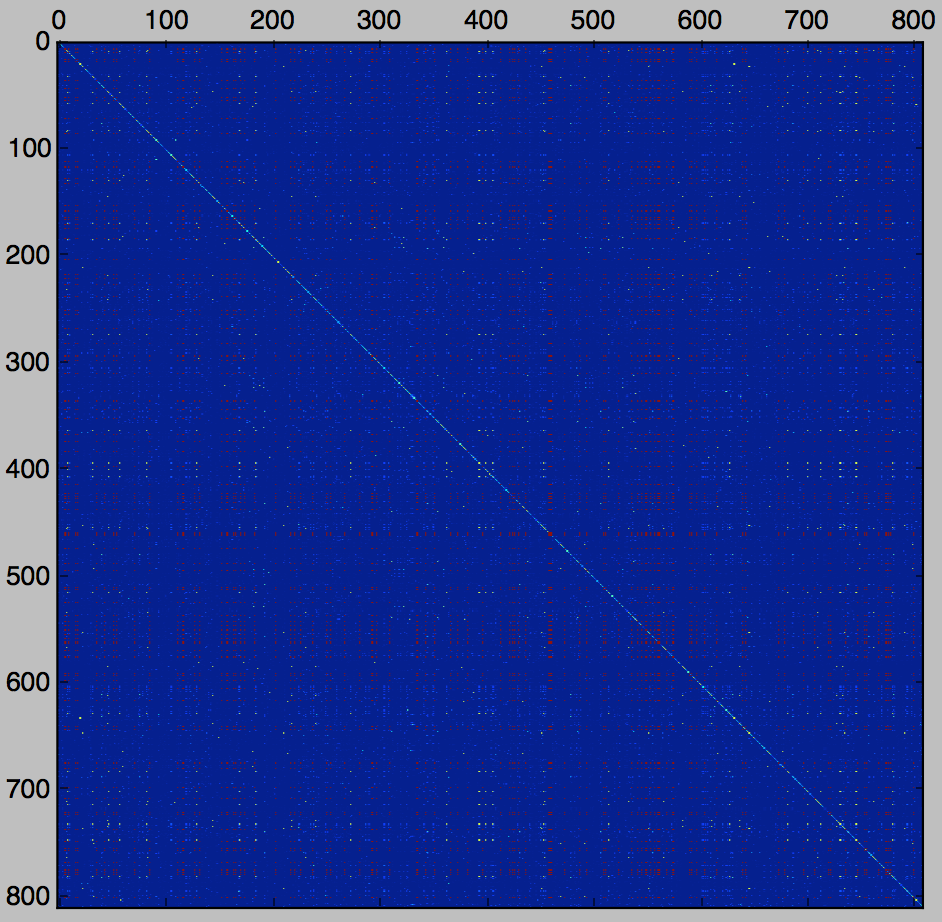
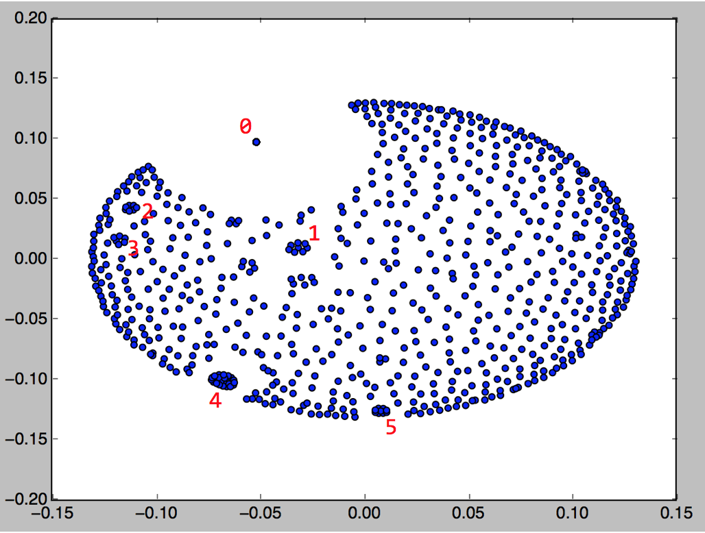

# visualize language model
You may refer to LM_usage.ipynb for running a quick demo.

[Notice] currently, the LM.py only support inner-product distance

## Analysis
After we built the language models, we can try to do some analysis on top of the language models. 
However, the language models space is very sparse, which make distance metric like L2 (the most commonly seen one) meaningless. To enable analysis on language models, we use the inner_product similarity metric. 

After computed the similarity matrix (810x810, since there are 810 chatrooms in YAO_msgDict.txt) of chatrooms, we visualize the similarity matrix by plotting it out.

  

We could barely discover any useful information by looking at the similarity matrix. To discover more useful information, we tried manifold learning.

#### Locally Linear Embedding (LLE)
Locally Linear Embedding ("Nonlinear Dimensionality Reduction by Locally Linear Embedding", Sam T. Roweis et. al., 2000) have been proven to be a powerful manifold learning method that capture the local information. 
However, it uses the compressive sensing technique which require the input data points and try to reconstrcut each points by its neighbors. As we know, our language model space now is very sparse, that make the reconstrcution process infeasible. So, we have to use similarity-matrix-based manifold learning methods.

### Multidimensional Scaling (MDS)
Multidimensional scaling ("Multidimensional Scaling", M Steyvers, 2001) is a means of visualizing the level of similarity of individual cases of a dataset. 
It only require the similarity between each pair of datapoints, no original observation needed. Thus, it is very suitable to our case.
After applying MDS analysis, we can now see the clustering effect of language models in the embedding space and we are ready to dive more deep into the data.

  

